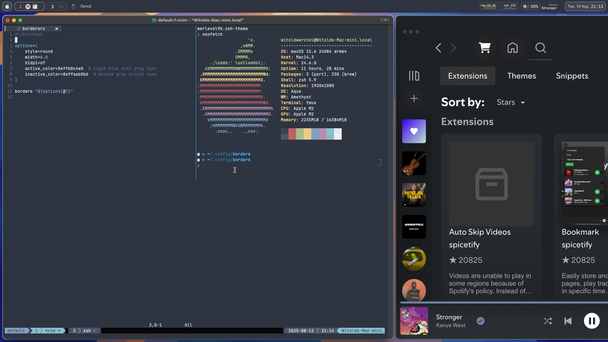

# Dotfiles
## Dark theme:


## Light theme:


--------------------------------------------------------

## Requires: 

MacOS

Xcode 

Metal api

clangd 

nvim 0.11

----- 

## Features:

**Nvim :**

Lsp support

Many usefull macros and keybinds

Tex support

Treesitter support

Telescope support

Debugging and testing helper, suspicious variable analyzer 

Live Preview

And many more!

**Spicetify:**
A nice theme for spicetify

**Sketchybar**
A good replacement for the native menu bar using nord colors changes colors depending on if dark mode or light mode is activated.

**Janky Borders**
Borders for windows, nord colors.

**Yabai along with skhd integration for keybinds see .shkhdrc file for reference**
An automatic tiling window manager with FelixKratz settings.

**Tmux**
For better tab and pane managment, ressurect in iterm2 also has nord colors

The repo also contains a Default.json with nord colors for iterm.

----

## Installation

**Run:**
```sh
curl -L https://raw.githubusercontent.com/Okerew/dotfiles/refs/heads/main/install.sh | sh
```

Then to finish installation in nvim run `PlugInstall`
